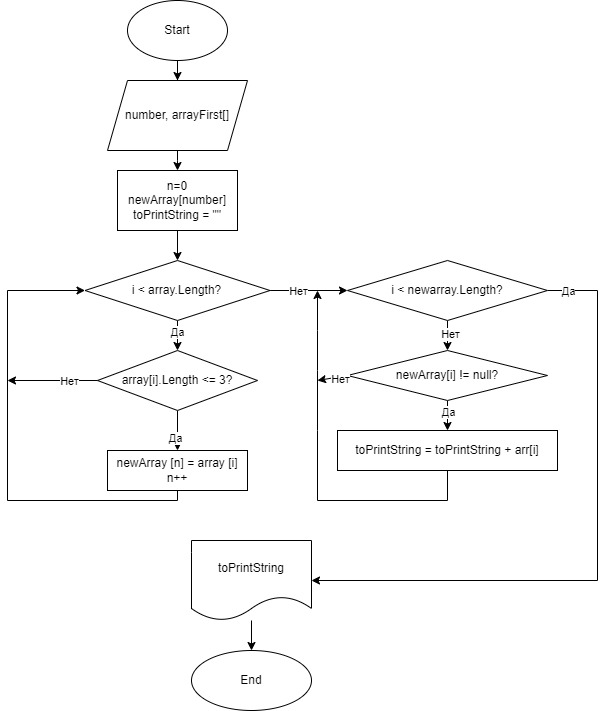

## Написать программу, которая из имеющегося массива строк формирует массив из строк, длина которых меньше либо равна 3 символа. Первоначальный массив можно ввести с клавиатуры, либо задать на старте выполнения алгоритма. При решении не рекомендуется пользоваться коллекциями, лучше обойтись исключительно массивами.

__Метод ArrayText: из введенных элементов массива строк формируется новый массив, длина элементов которого меньше или равна 3 символа__
В данном методе в цикле проверяем длину элемента (<=3). Подходящие под условия элементы метод возвращат новым массивом 

__Метод PrintArray: в консоль выводится массив с подходящими по условию элементами__ 
Если подходящих для вывода элементов нет, то выводится сообщение: "Не введены подходящие элементы для формирования нового массива"

_Блок-схема алгоритма_
